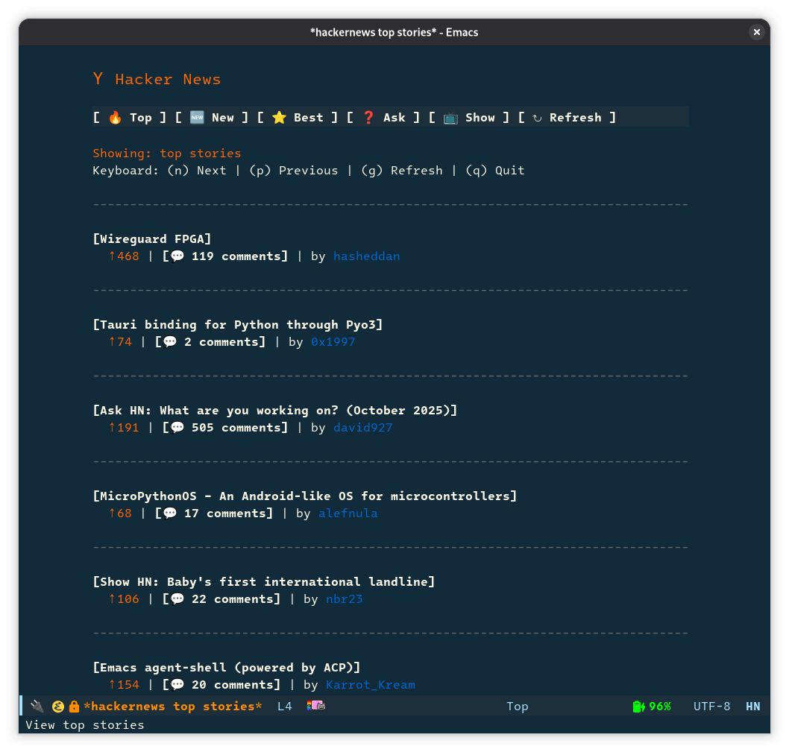

# Hacker News Modern Emacs Client

Fork of [hackernews.el](https://github.com/clarete/hackernews.el) with a modern,
widget-based interface.

Requires Emacs 28.1 or later.

It doesn't actually interact with [Hacker News](https://news.ycombinator.com/)
directly. It uses the [Hacker News API](https://hacker-news.firebaseio.com/v0)
to get the data.

## Interface

The interface fetches stories from six different feeds: top, new, best, ask,
show and job. The default feed is top stories, which corresponds to the Hacker
News homepage.

Each story is displayed as a clickable title widget, followed by metadata
(score, comment count, and author) with color coding. The header includes
navigation buttons for switching between feeds and refreshing the current feed.

Content is formatted to a configurable width (default 80 characters). If the
[`visual-fill-column`](https://github.com/joostkremers/visual-fill-column)
package is installed, it will be used to center the content automatically.

Clicking or pressing <kbd>RET</kbd> on a story title opens it with
[`browse-url`](https://gnu.org/software/emacs/manual/html_node/emacs/Browse_002dURL.html),
which uses the system default browser. Clicking a comment count opens the
comments page in the same way.

## Keymap

| Key            | Description                                |
|----------------|--------------------------------------------|
| <kbd>RET</kbd> | Activate widget at point (open link)       |
| <kbd>n</kbd>   | Move to next story                         |
| <kbd>p</kbd>   | Move to previous story                     |
| <kbd>TAB</kbd> | Move to next widget (buttons, links, etc.) |
| <kbd>m</kbd>   | Load more stories                          |
| <kbd>g</kbd>   | Reload stories                             |
| <kbd>f</kbd>   | Prompt for a feed to switch to             |
| <kbd>q</kbd>   | Quit                                       |

All feed loading commands accept an optional [numeric prefix
argument](https://gnu.org/software/emacs/manual/html_node/emacs/Arguments.html)
denoting how many stories to fetch. For example,
<kbd>M-5</kbd><kbd>0</kbd><kbd>g</kbd> reloads the current feed and fetches
its top 50 stories. With no prefix argument, the value of
`hackernews-items-per-page` is used.

## Screenshot



## Installation

### Manual

Clone the repository and place `hackernews-modern.el` in a directory on your
`load-path`, then add to your `user-init-file`:

```el
(autoload 'hackernews-modern "hackernews-modern" nil t)
```

Or, to load it immediately at startup:

```el
(require 'hackernews-modern)
```

### use-package

```el
(use-package visual-fill-column
  :ensure t)

(use-package hackernews-modern
  :load-path "/path/to/hackernews-modern.el"
  :config
  ;; Optional: enable emoji icons in the header and comment counts
  (setq hackernews-enable-emojis t)
  ;; Optional: customize display width (default 80)
  ;; (setq hackernews-display-width 100)
  )
```

## Usage

Run <kbd>M-x</kbd> `hackernews` <kbd>RET</kbd>. The feed is determined by
`hackernews-default-feed`, which defaults to top stories. Direct commands for
each feed are also available:

- `hackernews-top-stories`
- `hackernews-new-stories`
- `hackernews-best-stories`
- `hackernews-ask-stories`
- `hackernews-show-stories`
- `hackernews-job-stories`

## Customization

Run <kbd>M-x</kbd> `customize-group` <kbd>RET</kbd> `hackernews` <kbd>RET</kbd>
to list all available options.

Key options:

- `hackernews-items-per-page` (default `20`): Number of stories to fetch per
  page.
- `hackernews-default-feed` (default `"top"`): Feed to load on startup.
- `hackernews-display-width` (default `80`): Maximum content width. Content is
  centered automatically when `visual-fill-column` is installed.
- `hackernews-enable-emojis` (default `nil`): Show emoji icons in feed buttons
  and comment counts.

## License

Copyright (C) 2012-2025 The Hackernews.el Authors

This program is free software; you can redistribute it and/or modify
it under the terms of the GNU General Public License as published by
the Free Software Foundation, either version 3 of the License, or
(at your option) any later version.

This program is distributed in the hope that it will be useful,
but WITHOUT ANY WARRANTY; without even the implied warranty of
MERCHANTABILITY or FITNESS FOR A PARTICULAR PURPOSE.  See the
GNU General Public License for more details.

You should have received a copy of the GNU General Public License
along with this program.  If not, see <https://www.gnu.org/licenses/>.
